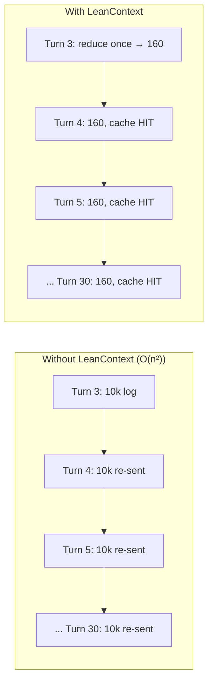
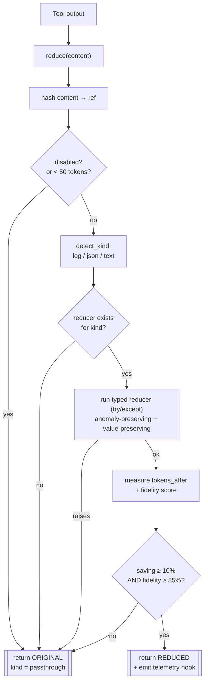
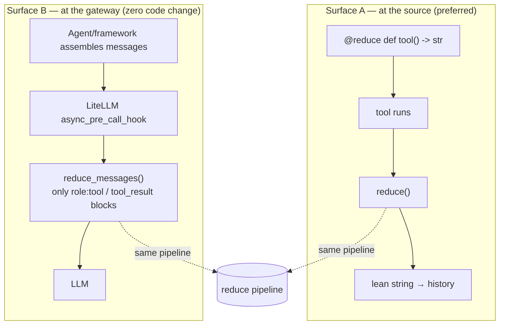
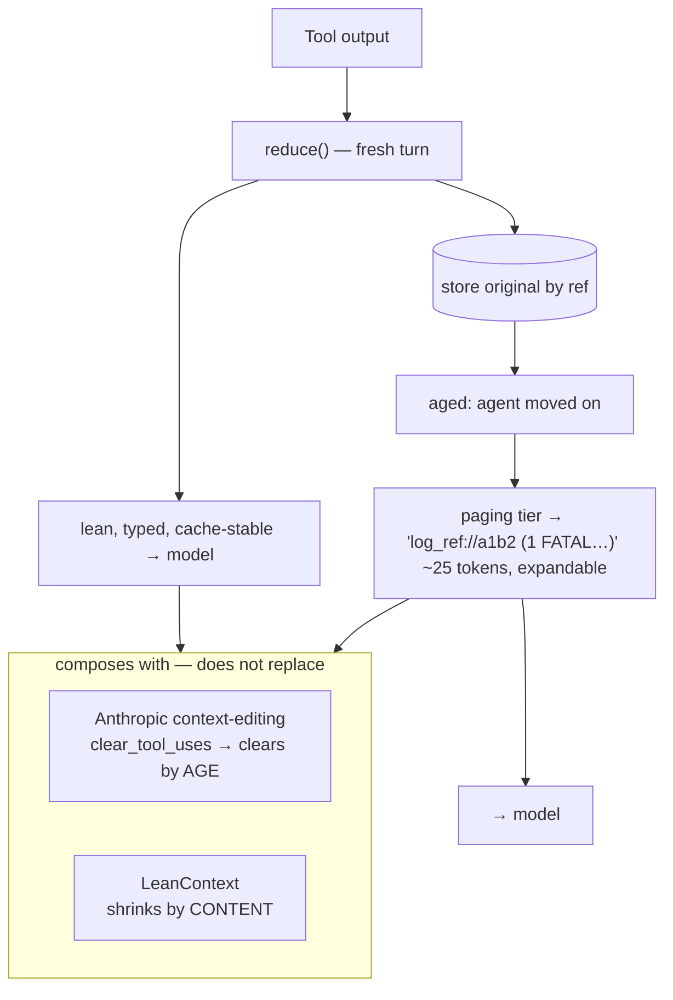

# LeanContext — How it works

LeanContext reduces what an agent sends to the model by shrinking **tool outputs at the source**,
deterministically and type-aware, with a fidelity score on every reduction. It can only ever
**help or no-op** — never corrupt the agent's context.

---

## 1. The problem: the quadratic tax

A tool output added on turn *N* is re-sent on every later turn. A 10k-token log in a 30-turn
session costs ~10k × 27 ≈ **270k tokens** — the bill is dominated by *re-sent* context.

---

## 2. The reduce() pipeline (the heart)

Every non-happy branch returns the **original text unchanged** (fail-open). Reductions are
deterministic and content-addressed, so the same input always yields the same bytes — which keeps
the provider prompt-cache hitting.

**Typed reducers**
- **logs** — mask volatile parts (timestamps, ids, numbers) → group identical templates → keep one
  representative + a count; error/anomaly/unique lines kept verbatim.
- **json** — factor repeated keys out once, emit values columnar (near-lossless).

---

## 3. Two integration surfaces, one core

- **Surface A** knows the content type at birth → safest, highest ratio. (`@reduce`, `wrap(tools)`)
- **Surface B** captures agents you can't modify, any language. (LiteLLM proxy/SDK)
- Instructions (system/user/assistant) are **never** touched — only tool results.

---

## 4. The full vision (v0.2+): paging + provider-native interop

LeanContext shrinks **by content** on ingest; Anthropic context-editing clears **by age**. They run
together — cross-provider, deterministic, measurable.
